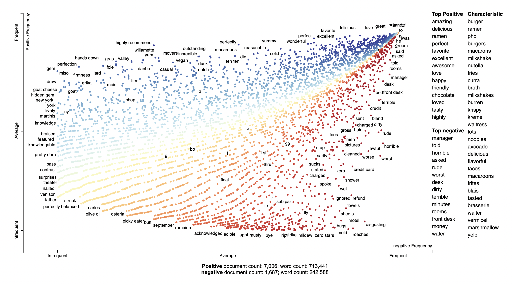

# Yelp Sentiment Analysis

## Introduction:

Our goal is to build unsupervised Natural Language Processing (NLP) machine learning models to predict whether a business review text is positive or negative. Also, assigns topics(clustering) based on the raw text data to find out the business domains.

## Project Progress:

After importing the datasets from [Yelp](https://www.yelp.com/dataset) in json format, we selected a sample of 10000 observations. Then, we cleaned the raw text data by removing digits, punctuation, special characters stop words, non-English words, converting words to lower case, lemmatization, and adding a spell checker. Also, stars (rating) between 1 to 5 were converted to a sentiment with 4 and 5 = positive, 1 and 2 = negative, while dropping 3-stars ratings. Next, we applied vectorization and choose logistic regression as the baseline model with an excellent accuracy score of 95% with no overfitting. For Visualization, we used Scattertext as shown in the graph below.

## Graphs:

## Further Action:

Applying dimensionality reduction methods such as PCA/SVD to successfully build a recommendation system and topic clustering.

## Tools:
•Jupyter Notebook •Seaborn •Matplotlib •Numpy •Pandas •Sklearn •Pickle •Nltk •String •Regular Expression •Scattertext

